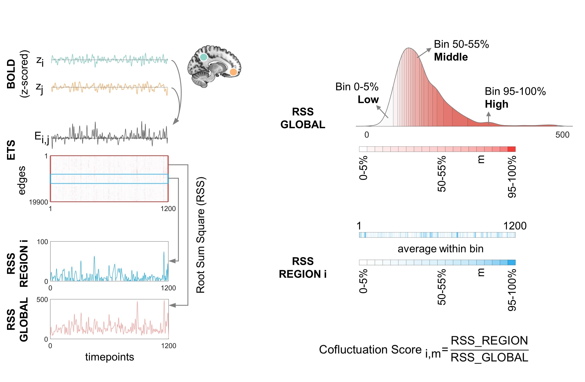

# Welcome to the Co-fluctuation Score repository!

The Co-fluctuation Score is a novel dynamic measure for systematically characterizing transient reorganization of the human brain functional connectome. Here, we provide basic code for calculating the Co-fluctuation Score from BOLD time series.

The accompanying manuscript is available in bioRxiv.

[Human cortex organizes dynamic co-fluctuations along sensation-association axis](https://www.biorxiv.org/content/10.1101/2025.07.14.660681v1)

### Edge Timeseries and Co-fluctuation Amplitude

- **BOLD -> ETS -> Co-fluctuation Amplitude**

- For each pair of brain regions, their edge timeseries is derived from the element-wise product of z-scored BOLD timeseries. At each timepoint, global or regional co-fluctuation amplitudes are computed as the root sum of squares (RSS) of ETS across all edges (RSS GLOBAL) or across edges connected to a given region (RSS REGION). 

  

### Co-fluctuation Score

- **Regional and global co-fluctuation amplitude to co-fluctuation score**
- Amplitude-stratified co-fluctuation scoring. Timepoints are ranked by their global RSS values and partitioned into 20 bins (5 % of timepoints/bin). Within each bin, global and regional RSS values are averaged. The regional co-fluctuation score is defined as the ratio of regional RSS to global RSS from a specific bin. 

If you have any issues, please email De-Zhi Jin (dzjin@bupt.edu.cn) and Ye He (yehe@bupt.edu.cn), we are willing to help you to solve your problem. Happy researching!
