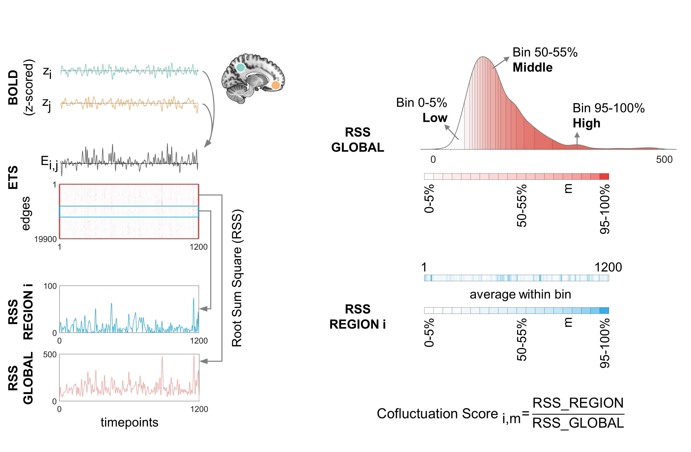

# 🧠 Co-fluctuation Score Repository

Welcome! 👋

The **Co-fluctuation Score (CS)** is a novel dynamic measure for characterizing transient reorganization of the human brain functional connectome. This repository provides code to compute CS from BOLD time series and reproduce the main analyses.

📄 **Manuscript (bioRxiv):**
[Human cortex organizes dynamic co-fluctuations along sensation-association axis](https://www.biorxiv.org/content/10.1101/2025.07.14.660681v1)

## ⚙️ How the Co-fluctuation Score is Computed

The script `calculate_cofluctuation_score.m` provides a minimal working example.

### 🔹 From BOLD Time Series to Co-fluctuation Amplitude (a)

1. BOLD signals are **z-scored**
2. Edge time series (ETS) are computed as the **element-wise product** between all pairs of regions
3. At each time point:
   - **Global RSS**: root sum of squares across all edges
   - **Regional RSS**: root sum of squares across edges connected to a region

### 🔹 Co-fluctuation Score  (CS, b and c)

1. Time points are ranked by **global RSS**
2. Partitioned into **20 bins** (5% per bin)
3. Within each bin:
   - Compute mean global RSS and regional RSS
4. **CS** = regional RSS / global RSS

## 📂 Co-fluctuation Analysis

### 🧠 Main Scripts

Compute CS and its variants:

- **HCP3T** → `bins_hcp_co_fluc_analysis.m`
- **HCP7T** → `bins_hcp7t_co_fluc_analysis.m`
- **HCPD** → `bins_hcpd_co_fluc_analysis.m`
- **CCNP** → `bins_ccnp_co_fluc_analysis.m`

------

## 📊 Analysis Scripts (`scripts/`)

### 🔹 Core Analyses

- `testing_hcp3t_cs.m`, `testing_hcp3t_cs_server1.m`, `testing_hcpd_cs.m`, `testing_hcpd_cs.R`
  - Spatial similarity between bins
  - Alignment with SA axis
  - Data preparation for GAM
- `testing_local_global_eta.m`, `testing_local_global_lead_lag.m`
  - Local vs global RSS
  - Event-triggered analysis
  - Lead–lag relationships
- `testing_phase_random.m`
  - Phase-randomization control analysis
- `testing_individual_analysis.m`
  - Individual-level CS analysis

------

### 🔹 Noise & Physiological Confounds

- `testing_tSNR.m`
  - Effect of tSNR on CS
- `testing_noise.m`, `testing_hcp3t_gsr_fd_hr_br_rss.m`, `plot_noise.R`
  - Relationship between global RSS and:
    - Head motion (FD)
    - Global signal (GS)
    - Respiratory variability (RV)
    - Heart rate variability (HRV)
- `testing_covariates.m`
  - GAM comparison:
    - Partial covariates: sex, mean FD
    - Full covariates: age, sex, tSNR, mean FD, mean GS, mean RV, mean HRV
- `testing_ets_rss_physio_phase_mapping.m`
  - Phase-locking with physiological signals

------

### 🔹 GAM Modeling

- `GAMs_fixed.R`
  - Fixed & mixed-effect GAM definitions
- Model fitting:
  - `fit_GAMs_fixed_schaefer200x17.R`
  - `fit_GAMs_fixed_schaefer400x17.R`
  - `fit_GAMs_fixed_glasser360.R`
  - `fit_GAMs_mixed_schaefer200x17.R`
- Visualization:
  - `plot_GAMs_fixed_results.R`
  - `plot_CS_GAM_results.R`
- `testing_GAMs_linear_nonlinear.m`, `testing_GAMs_linear_nonlinear.R`
  - Linear vs nonlinear GAM comparison (identify regions with significant differences)

------

### 🔹 Neurobiological Associations

- `extract_myelin_pvalb_sst_map.m`
  - Extract:
    - Myelin maps (HCP)
    - PVALB–SST maps (AHBA)
- `plot_mechanism_map.R`, `testing_gam_model.m`
  - Associate GAM summaries with:
    - Partial R²
    - Mean second derivative
    - Mean curvature

## 📧 Contact

For questions or issues:

- **De-Zhi Jin** — [dzjin@bupt.edu.cn](mailto:dzjin@bupt.edu.cn)
- **Ye He** — [yehe@bupt.edu.cn](mailto:yehe@bupt.edu.cn)

We’re happy to help — happy researching! 🚀
