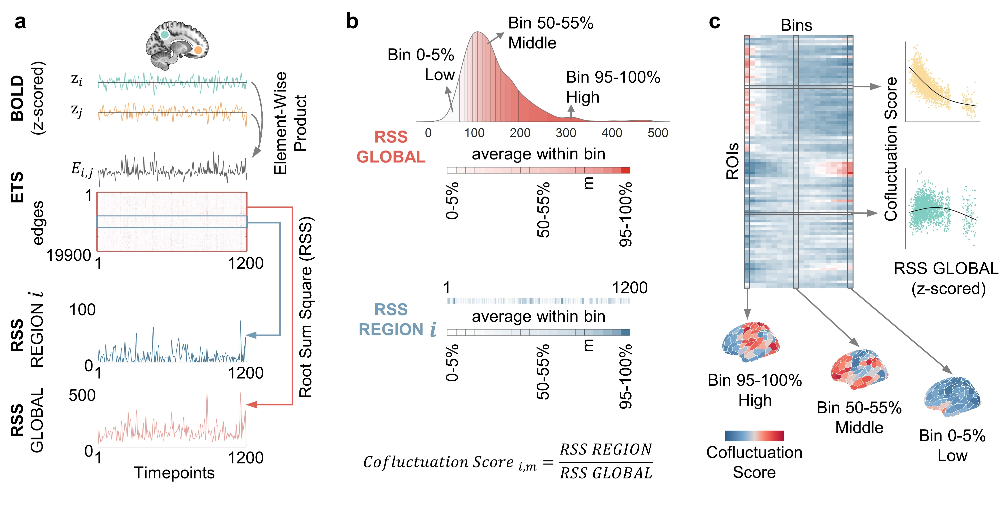

## Co-fluctuation Score

Computing edge-wise co-fluctuation amplitudes. For each pair of brain regions, their edge timeseries is derived from the element-wise product of z-scored BOLD timeseries. At each timepoint, global or regional co-fluctuation amplitudes are computed as the root sum of squares (RSS) of ETS across all edges (RSS GLOBAL) or across edges connected to a given region (RSS REGION). 

Amplitude-stratified co-fluctuation scoring. Timepoints are ranked by their global RSS values and partitioned into 20 bins (5 % of timepoints/bin). Within each bin, global and regional RSS values are averaged. The regional co-fluctuation score is defined as the ratio of regional RSS to global RSS from a specific bin. 

If you have any issues, please email De-Zhi Jin (dzjin@bupt.edu.cn) and Ye He (yehe@bupt.edu.cn), we are willing to help you to solve your problem. Happy researching!
